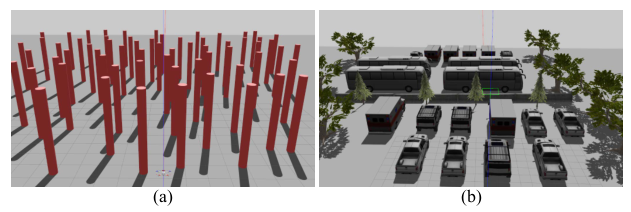
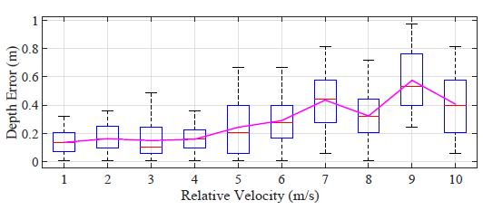
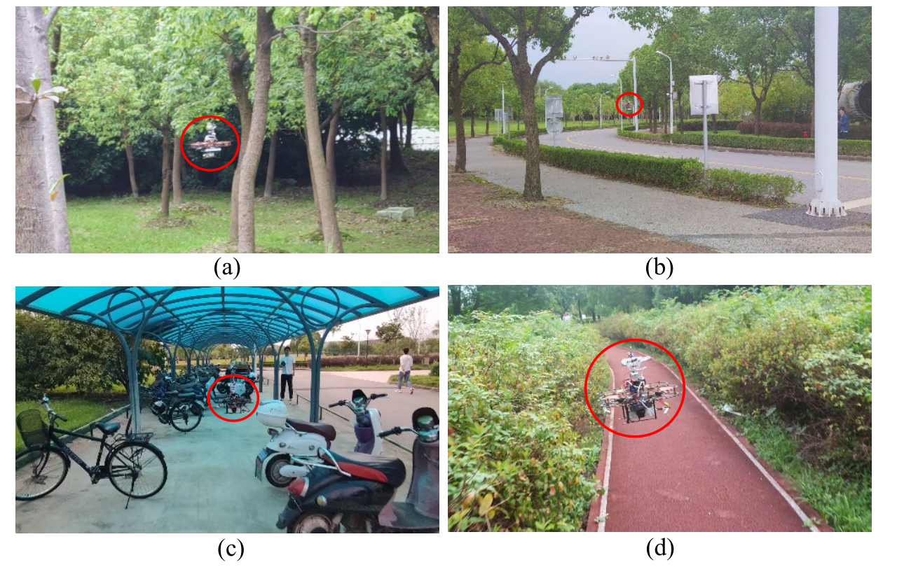

This repository is for paper *Efficient Local Trajectory Planning for High Speed Flight of a Quadrotor with Active Sensing*.
# Building Environment
- Ubuntu 16.04, ROS Kinetic
- Ubuntu 18.04, ROS Melodic
# Building Dependencies
- Eigen
- [Ewok](https://github.com/VladyslavUsenko/ewok/tree/master/ewok_ring_buffer/include/ewok). A version with our required IO functions is included in nags_planning/include.
# Building Steps
Clone this repository to your ROS workspace and run
```
catkin_make
```
# Test Results
## Simulation Result
- Test scenarios:



Map (a) is composed of cylinders with random positions to simulate a forest.

Map (b) is a parking lot with various vehicles and some natural trees.

- Tabel I Simulation Test Results in Map (A)

| Algorithm       | Avg. Flight Time | Collision Times | Trapped Times |
|-----------------|------------------|-----------------|---------------|
| U. Sampling [2] | 31.9s            | 0               | 0             |
| MAPF [3]        | xxx              | xxx             | xxx           |
| Our Planner     | 25.0s            | 0               | 0             |

- Tabel II Simulation Test Results in Map (B) 

| Algorithm       | Avg. Flight Time | Collision Times | Trapped Times |
|-----------------|------------------|-----------------|---------------|
| U. Sampling [2] | 44.9s            | 5               | 2             |
| MAPF [3]        | xxx              | xxx             | xxx           |
| Our Planner     | 42.7s            | 0               | 0             |

## Realworld Tests
### Qaudrotor Specification

| Rotor Base | Propeller Size | Motor           | Weight | Flight Controller | Onboard Computer |
|------------|----------------|-----------------|--------|-------------------|------------------|
| 210 mm     | 5 inches       | T-motor F40 Pro | 1.2 kg | Pixracer          | Up core board    |

### Sensor Specification

| Sensor                | Property                                                             | Usage                                                            |
|-----------------------|----------------------------------------------------------------------|------------------------------------------------------------------|
| Intel Realsense D435  | Max Range: about 10m FOV: 86°x 57°                                   | To generate pointclouds at 30Hz.                                 |
| Intel Realsense T265  | Providing under 1% closed  loop drift under intended use conditions. | To provide state estimation of the quadrotor.                    |
| FT motor SM30BL       | Angle resolution: 0.088° Max torque: 10kg*com                        | Control the active sensing camera and measure its angle.         |

**NOTE:**
- The Intel Realsense D435 is unable to detect the obstacles that are too thin or too tiny. In our test, a stick with the diameter of 2 cm can only be partially detected within 2.7 m and fully detected within 2 m.
- During high speed flight, Realsense D435 could have non-negligible motion blur. We did a test to measure this motion blur in our work *Bio-inspired Obstacle Avoidance for Flying Robots with Active Sensing*. The depth estimation error caused by the motion blur is shown in the image below, where the x-axis is the relative velocity between the camera and the obstacle.



### **Test video**

See:
<https://youtu.be/zgIZDW39KJs>

- Test scenarios:



# Citation

```
G. Chen, D. Sun, W. Dong, X. Sheng, X. Zhu, and H. Ding, "Efficient Local Trajectory Planning for High Speed Flight of a Quadrotor with Active Sensing", 2021. (Under revision)
```

```
@article{ActiveSensing,
title={Bio-inspired Obstacle Avoidance for Flying Robots with Active Sensing},
author={Chen, Gang and Dong, Wei and Sheng, Xinjun and Zhu, Xiangyang and Ding, Han},
journal={arXiv preprint arXiv:2010.04977},
year={2020}}
```

# License
+ New BSD License 

# Acknowledgement
We thank Shuhan He and Boyu Zhou for their help on this work.
